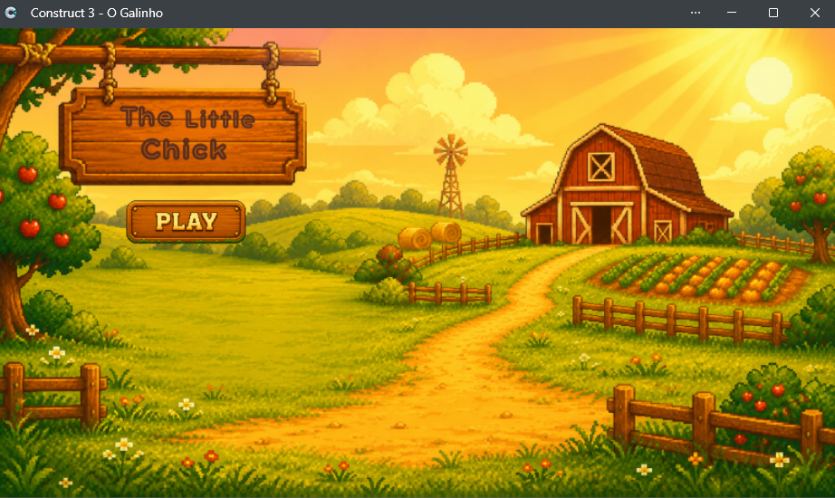
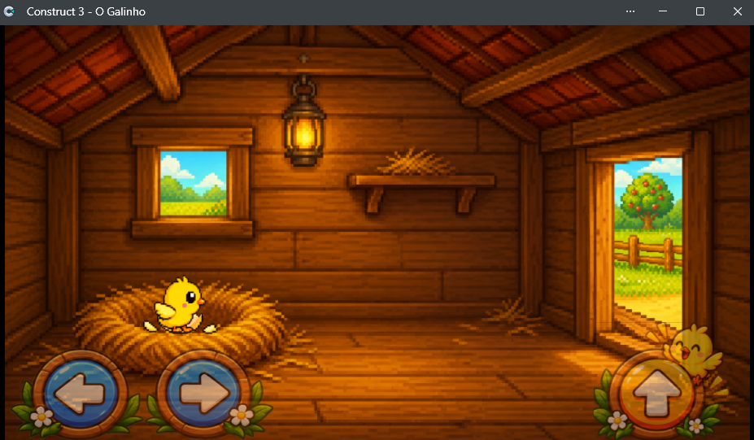
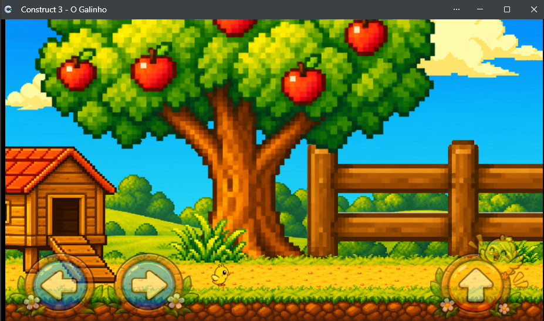
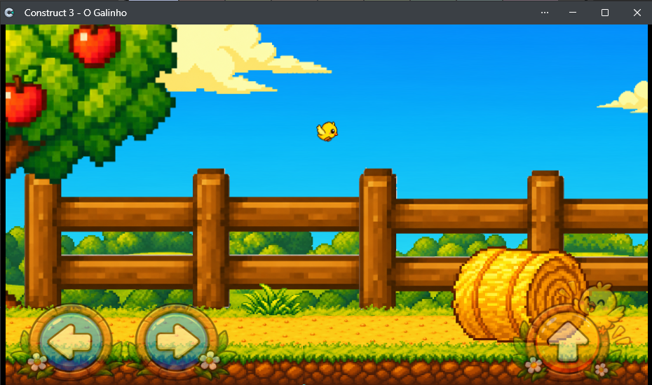
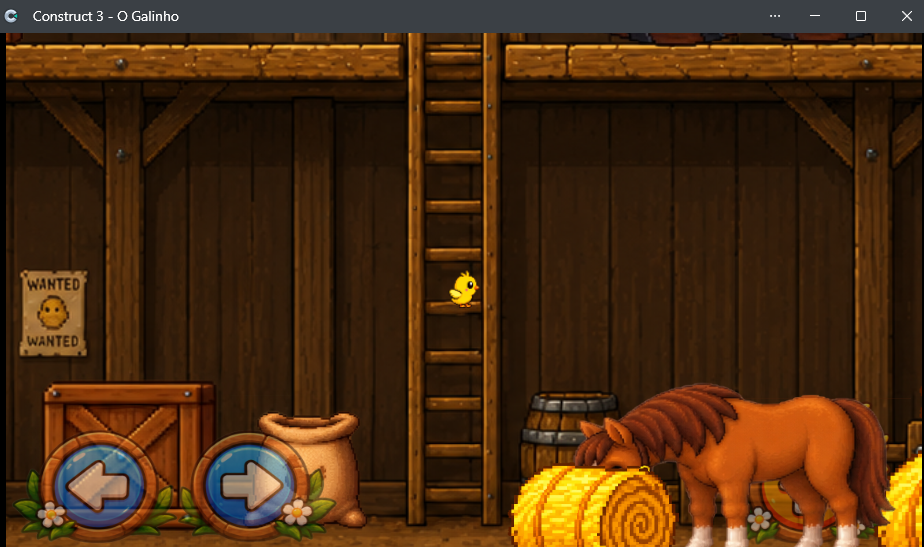
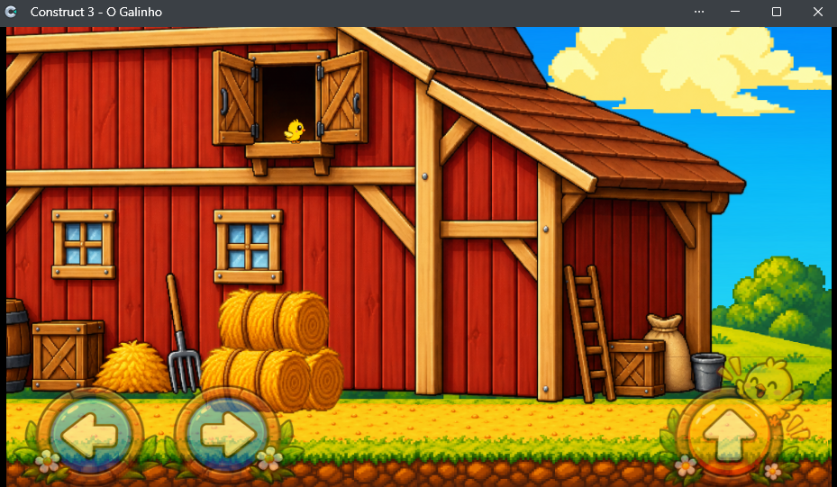
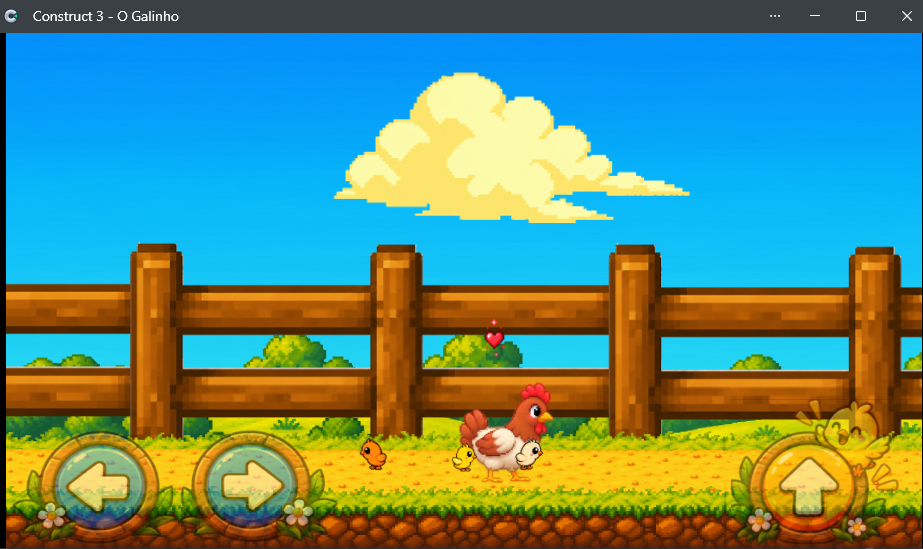
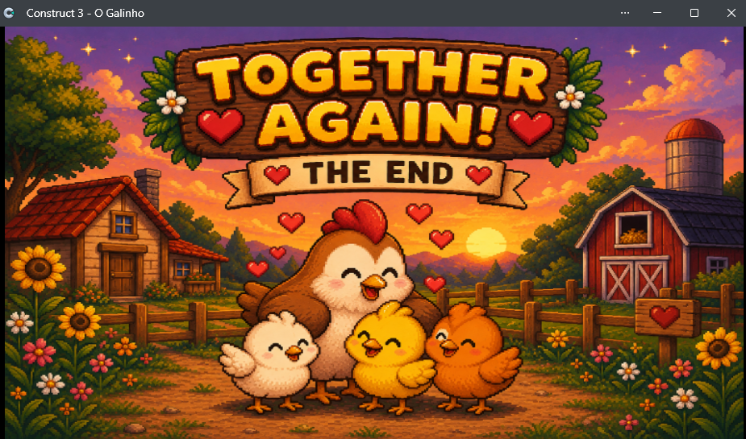

# 🐥 The Little Chick

A 2D mobile platform game developed in Construct 3.

## 🎮 About the Game

The Little Chick is a 2D platform adventure where you control a little chick on a journey to find its way back to its family.

The game was created as a learning project focused on mobile game development, gameplay mechanics, level design and 2D game development.

## 🛠️ Development

- **Engine:** Construct 3
- **Genre:** 2D Platformer
- **Platform:** Mobile
- **Development:** Personal Project
- **Status:** In Development

## 🎯 Features

- 2D platform gameplay
- Character movement and jumping
- Collectible items
- Environmental exploration
- Obstacles and challenges
- Mobile-oriented controls
- Multiple game scenes

## 📸 Gameplay

### Main Menu

## 📚 What I Learned

Through this project, I practiced:

- Game development fundamentals
- Construct 3
- 2D game design
- Character movement
- Level construction
- Game interface design
- Asset organization
- Project documentation
- Git and GitHub

## 👨‍💻 Developer

**Willian da Veiga Souza**

This project is part of my journey into game development and software development.

---

⭐ Thanks for checking out **The Little Chick**!
